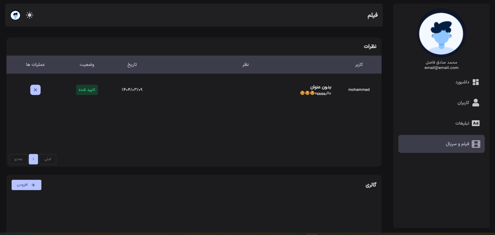
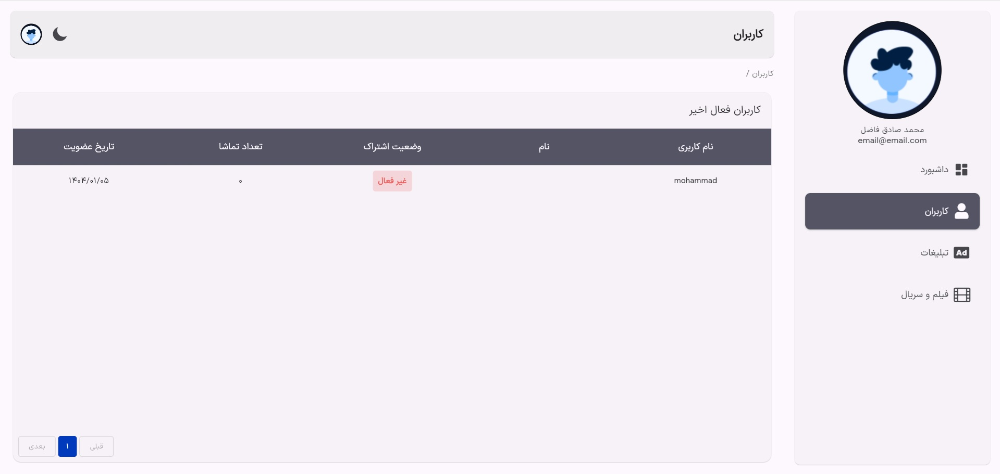
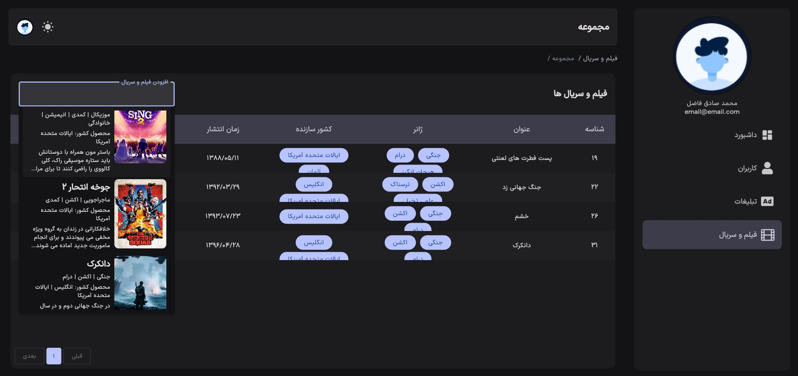
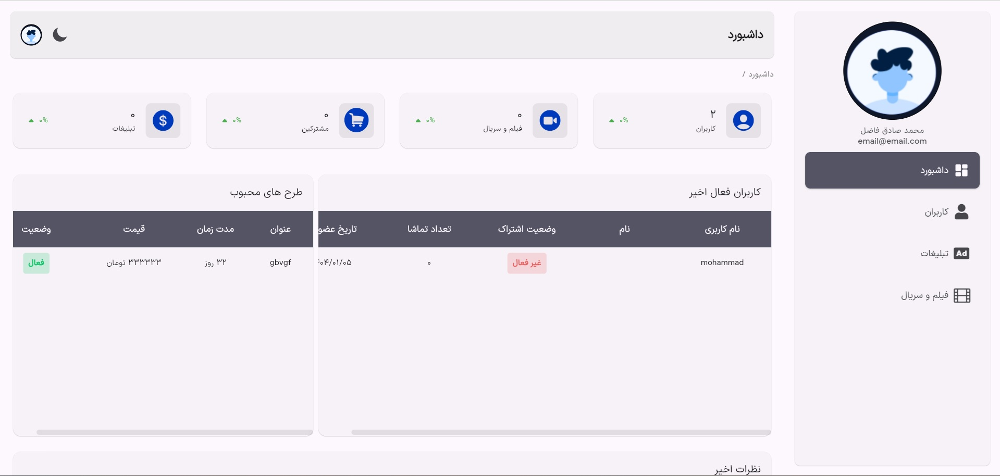
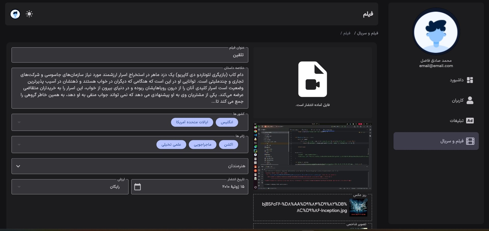
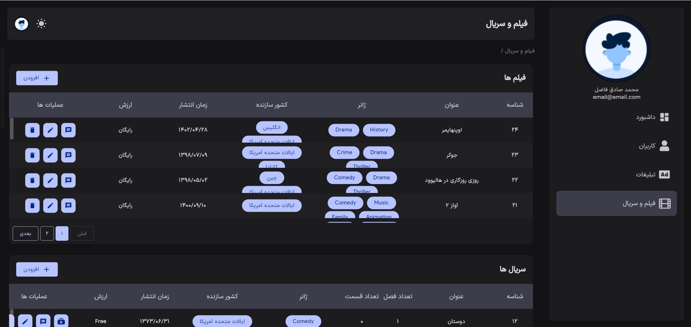
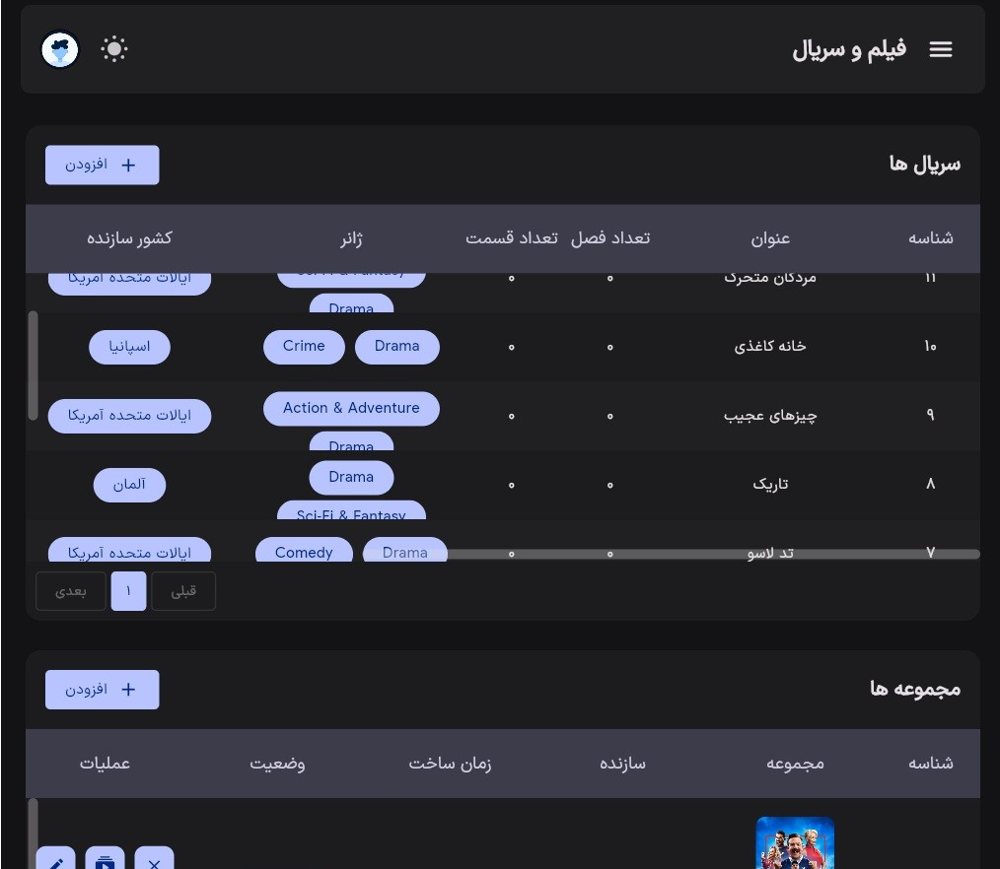

<h1 align="center">🛠️ Rokhshare Admin Panel</h1>

A custom web admin panel for managing the Rokhshare movie streaming platform, built with Flutter

---

## 📖 Overview

**Rokhshare Admin Panel** is a fully customized, web-based admin dashboard built with **Flutter Web**.  
It allows platform administrators and content managers to manage every aspect of the Rokhshare movie streaming service.  
The app follows **MVVM architecture** and uses **BLoC** for clean and testable state management.

This is a standalone Flutter Web project that connects to the Rokhshare Django backend via RESTful APIs.

## 🧩 Related Repositories

- 📱 **Mobile App** (Flutter): [Mobile Repository Link](https://github.com/Mohammadfazel03/rokhshare-app)
- 🎬 **Backend** (Django): [Backend Repository Link](https://github.com/Mohammadfazel03/rokhshare)

## 🎯 Key Features

- 🎬 **Add, edit, and delete movies and series**
- 💬 **Manage comments** for movies and series
- 📁 **Create and manage collections**
- 🎭 **Add, edit, and delete genres, countries, and artists**
- 🖼️ **Manage homepage slides** (carousel/sliders)
- 📢 **Add and manage advertisements**
- 💸 **Manage subscription plans and pricing**
- 👥 **User management**
- 🌗 **Supports light and dark themes**
- ✅ Clean MVVM architecture with BLoC state management

## 🛠 Tech Stack

- **Flutter** (Web)
- **Dart**
- **BLoC** for state management
- **MVVM** architecture
- **Dio** for API calls
- **Shared Preferences** for local storge
- **GetIt** for dependeny injection
- **Go Router** for routing
- **Responsive UI** for desktop browsers
- **Material 3**

## 📸 Web Screenshots

    
    
    
    
    
    
    
    
    
    
    
    
    

